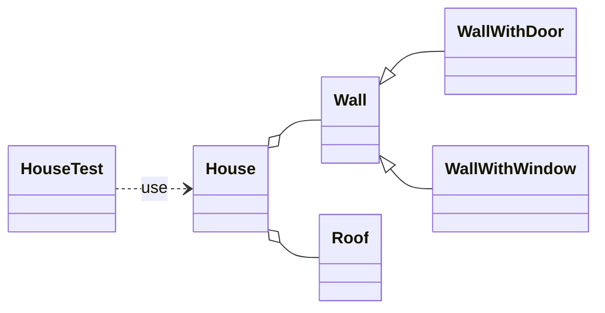

# Blockwelt-Explorer (ITF23)

Python extension for [pyblockworld](https://pypi.org/project/pyblockworld/): press **B** to build modular buildings.


📖 **Concepts & diagrams for every milestone:** [docs/concepts.md](docs/concepts.md)

## Run

Needs Python ≥ 3.13.

```bash
python3 -m venv venv
venv/bin/pip install pyblockworld        # Windows: venv\Scripts\pip ...
venv/bin/python3 main.py                 # then press B in the game
```

| Milestone | Run | What B does |
|---|---|---|
| 1 | `nr_1.py` | 3 brick in x, 4 sand in y, 5 stone in z |
| 2 | `nr_2.py` | 2 walls (one rotated) |
| 3 | `nr_3.py` | 2 × window wall + 2 × door wall |
| 4–5 | *(in the classes)* | visibility, `Roof` |
| 6 | `main.py` | a whole house |
| 7 | `python -m unittest -v` | runs `HouseTest` (no window needed) |

**Controls:** `WASD` walk · mouse look · `Space` jump · `Tab` fly · **`B` build** · `Esc` release mouse

## Structure



| File | Content |
|---|---|
| `wall.py` | `Wall`, `WallWithDoor`, `WallWithWindow` |
| `roof.py` | `Roof` |
| `house.py` | `House` |
| `test_house.py` | `HouseTest` |
