# Blockwelt-Explorer: Concepts

Visual cheat sheet for all 7 milestones. Screenshots are real renders of the scripts in this repo.

| # | Topic | File(s) |
|---|---|---|
| [1](#milestone-1-coordinates--setblocks) | Coordinates, `setBlocks` | `nr_1.py` |
| [2](#milestone-2-class-wall) | Class, object, constructor | `wall.py`, `nr_2.py` |
| [3](#milestone-3-inheritance) | Inheritance | `wall.py`, `nr_3.py` |
| [4](#milestone-4-visibility) | Visibility | all classes |
| [5](#milestone-5-roof--aggregation-vs-composition) | Aggregation / composition | `roof.py` |
| [6](#milestone-6-house) | Putting it together | `house.py`, `main.py` |
| [7](#milestone-7-unit-test) | Unit tests | `test_house.py` |

---

## Milestone 1: Coordinates & `setBlocks`

```
        y (up)
        │
        └────── x
       ╱
      z
```

- Ground (grass) is at **y = -2**, so the first free layer is **y = -1**.
- `player_position(as_int=True)` gives whole block numbers.

### `setBlocks` takes two corners, not sizes

```python
world.setBlocks(x1, y1, z1,   x2, y2, z2,   material)
#               └ corner A ┘   └ corner B ┘
```

Everything in the box between A and B is filled, **both corners included**.

```
3 blocks in x, starting at 12:

x:  11   12   13   14   15
         [■]  [■]  [■]
          A         B        B = 12 + 3 - 1 = 14
```

> **Rule:** `end = start + count - 1`

Top view of `nr_1.py`:

```
z
↑        x  x+1 x+2 x+3 x+4
│ z+4                    T
│ z+3                    T        B = brick  3 in x
│ z+2    S               T        S = sand   4 in y (pillar)
│ z+1                    T        T = stone  5 in z
│ z      B   B   B       T
└──────────────────────────→ x
```

> ⚠️ **Counting trap:** if the rows share a corner block, the pillar measures 4 + 1 = 5 tall.
> Keeping them apart makes every row countable on its own.

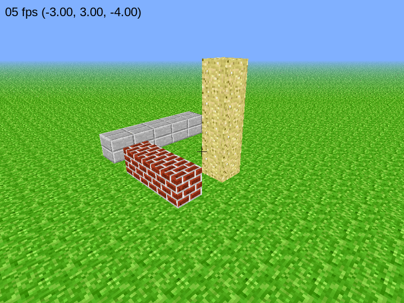

---

## Milestone 2: Class `Wall`

### Class vs. object

A **class** is the blueprint, an **object** is one thing built from it. Every object has its *own* attributes (`self.…`).

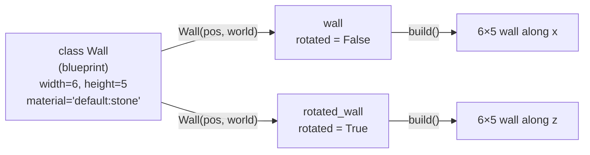

### Reading the UML class box

```
┌──────────────────────────────┐
│ Wall                         │  ← class name
├──────────────────────────────┤
│ + width: int = 6             │  ← attribute : type = default
│ # bw: BlockWorld             │
├──────────────────────────────┤
│ + Wall(pos, bw)              │  ← constructor  →  __init__(self, pos, bw)
│ + build(): void              │  ← method, returns nothing
└──────────────────────────────┘
```

| UML | Python |
|---|---|
| `= 6` default value | set in `__init__`, **not** a parameter |
| `Wall(pos, bw)` constructor | `def __init__(self, pos, bw)` |
| `: void` | no `return` |

### `rotated`: turning 90° around the y-axis

`Wall._fill(a1, h1, a2, h2, material)` works in **wall coordinates**: `a` = along the wall, `h` = height.
`rotated` decides whether `a` becomes **x** or **z**:

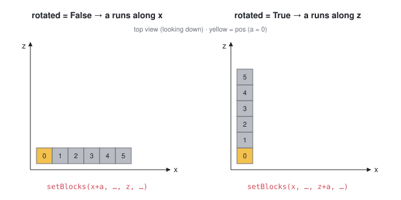

### What happens when you press B

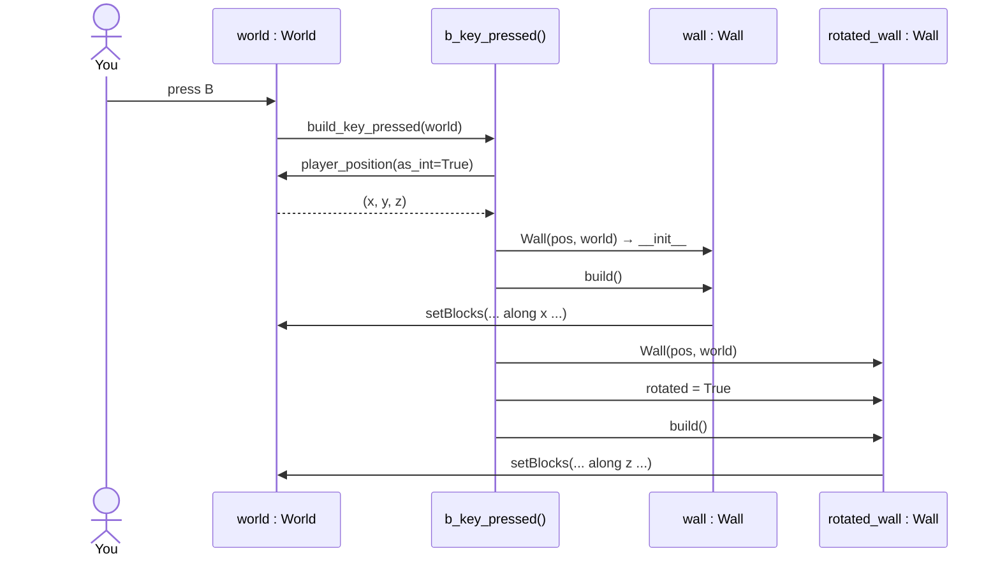

### Why only ONE `World()`

Every `World()` opens its **own window**. The wall gets the world *passed in* (`bw`) instead of creating one.
That pattern is called **dependency injection**, and it's why every class in the diagram has `bw`.

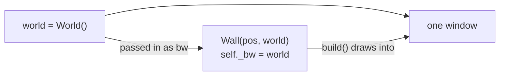

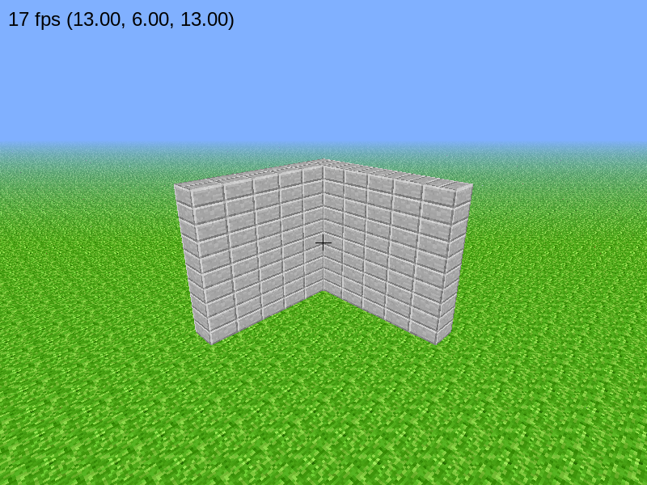

---

## Milestone 3: Inheritance

> **Worksheet question:** *What does the arrow between the classes mean?*
> The hollow triangle arrow means **inheritance** ("is a"). `WallWithDoor` **is a** `Wall`: it gets all
> attributes and methods of `Wall` and only adds what's new (`door_material_id`) or changes (`build()`).
> The arrow points from the subclass to the superclass.

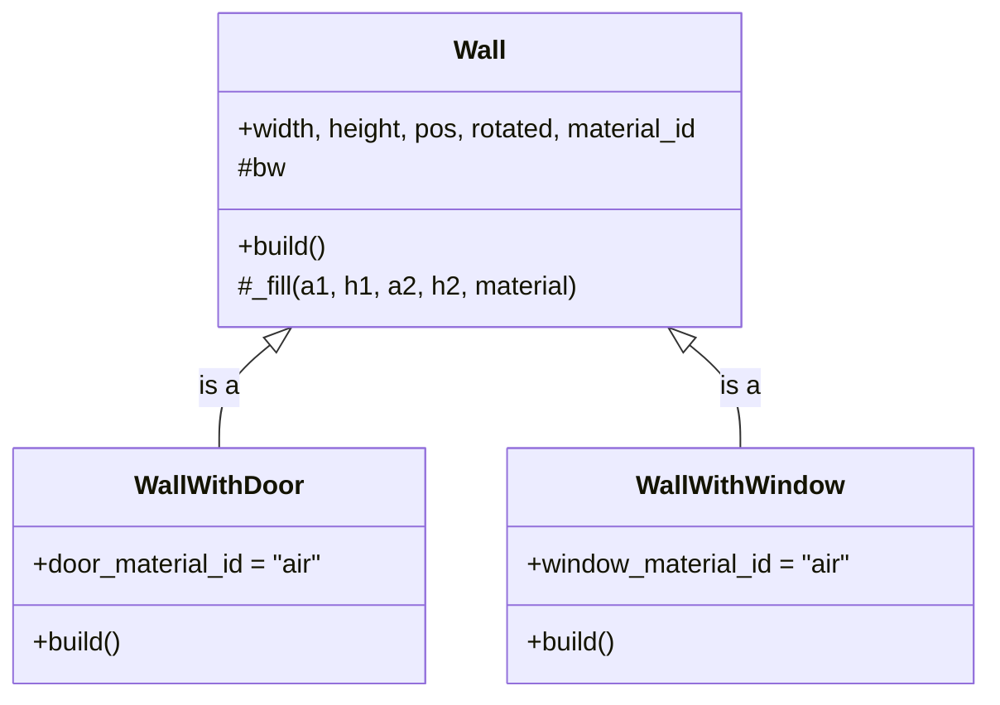

### `super()`: reuse, then add

The subclass **overrides** `build()`, but first calls the parent's version with `super().build()`:

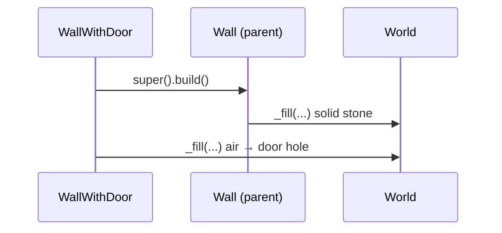

Same idea in `__init__`: `super().__init__(pos, bw)` sets width, height … so we only add `door_material_id`.

What each `build()` draws (front view):

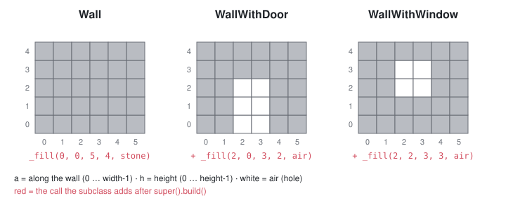

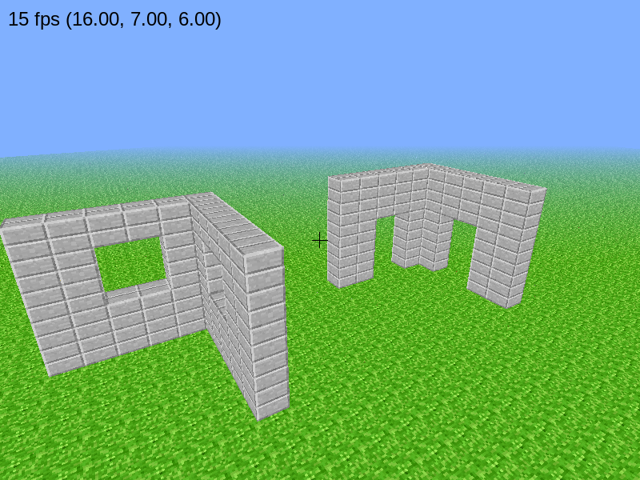

---

## Milestone 4: Visibility

> **Worksheet question:** *Differences between public, private and protected?*

| UML | Name | Who may use it | Python | Example |
|---|---|---|---|---|
| `+` | public | everyone | `self.width` | `wall.width = 8` |
| `#` | protected | the class **and its subclasses** | `self._bw` | `WallWithDoor` uses `_bw` via `_fill` |
| `-` | private | **only the class itself** | `self.__bw` | `House.__bw`, `Roof.__bw` |

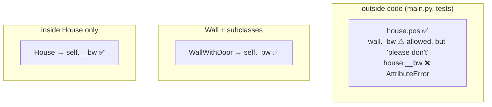

> Python doesn't *enforce* `_`, it's a convention. `__` triggers **name mangling**:
> `self.__bw` inside `House` is stored as `self._House__bw`, so `house.__bw` from outside fails.

---

## Milestone 5: Roof & aggregation vs. composition

> **Worksheet question:** *What does the diamond mean?*
> The diamond marks a **"has a"** relationship (part–whole). It sits at the **whole** (`House`).
> A **hollow ◇** means **aggregation**: parts can exist on their own. A **filled ◆** means **composition**: parts live and die with the whole.

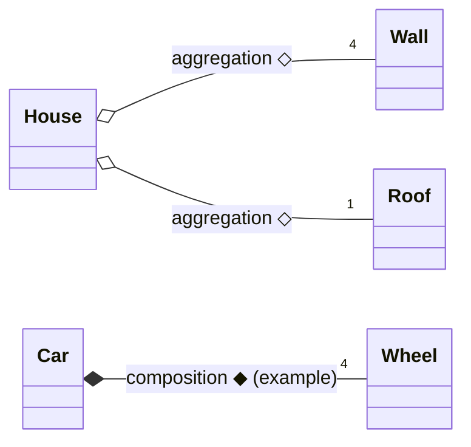

| | Aggregation ◇ | Composition ◆ |
|---|---|---|
| Meaning | "has a" | "consists of / owns" |
| Part without whole? | ✅ can exist alone (a `Wall` works without a `House`, see Milestone 2) | ❌ dies with the whole |
| Example | team ◇ player | house ◆ room |

> Our `House` creates its walls itself in `__init__`, so in practice it's close to composition.
> The worksheet diagram draws a hollow ◇, so we name it aggregation. Both answers are fine if you can explain the difference.

---

## Milestone 6: House

> A house = 1 wall with door + 2 walls with windows + 1 solid wall + 1 roof.

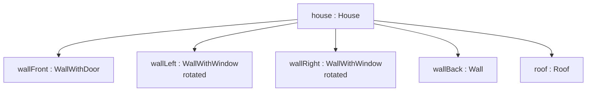

Where each wall goes (6 × 6 footprint):

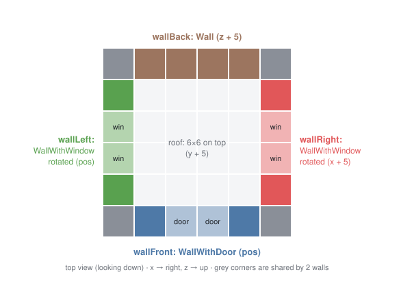

`House.build()` just **delegates**: it asks every part to build itself.

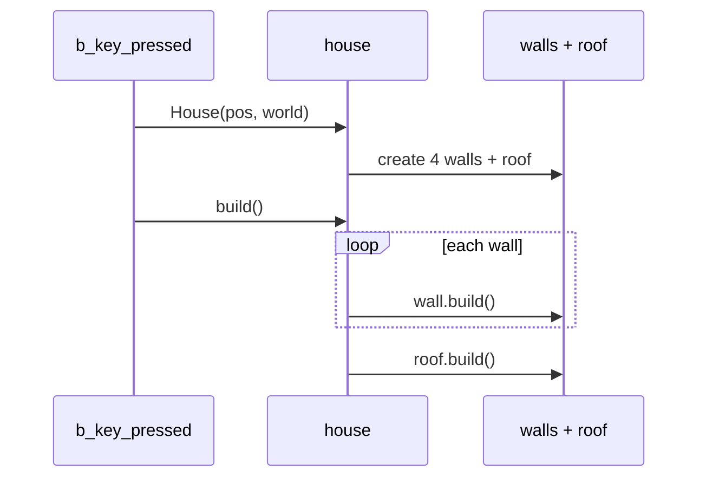

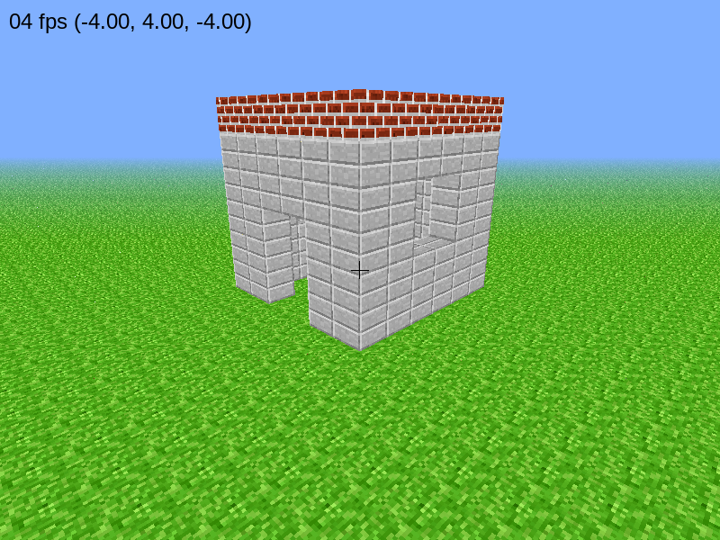
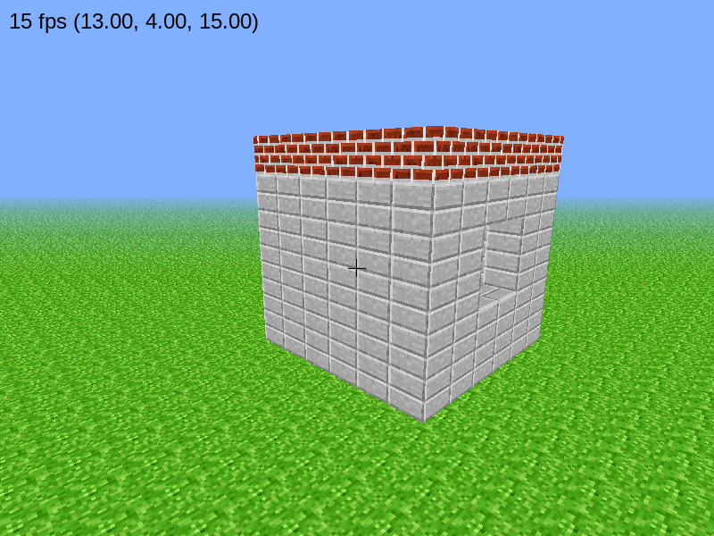

---

## Milestone 7: Unit test

A **unit test** checks one small piece of code automatically, with no clicking in the game.

```bash
python -m unittest -v
```

### Arrange, act, assert

```mermaid
flowchart LR
    A["<b>Arrange</b><br/>setUp()<br/>House((0,0,0), Mock())"] --> B["<b>Act</b><br/>change_wall_material('default:sand')"]
    B --> C["<b>Assert</b><br/>all 4 walls == sand?<br/>roof still brick?<br/>door still air?"]
    C -->|all true| OK["✅ OK"]
    C -->|one false| FAIL["❌ FAIL + which line"]
```

### What is `Mock()`?

A **stand-in object** that accepts any method call and does nothing. The test needs a `bw`,
but a real `World()` would open a game window. `Mock()` pretends to be the world.

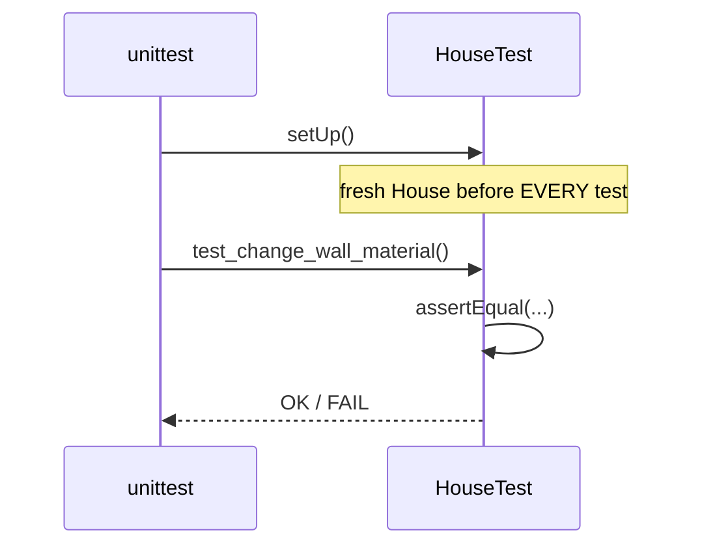

> `setUp()` runs **before every** `test_…` method, so each test starts with a fresh house.

`change_wall_material` only changes the attribute. Call `build()` again to see it:

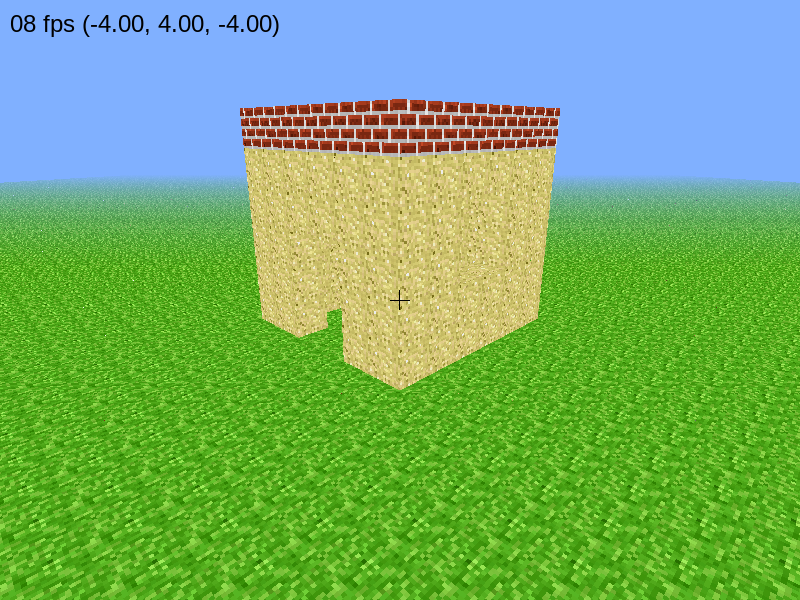

---

## Full class diagram (as implemented)

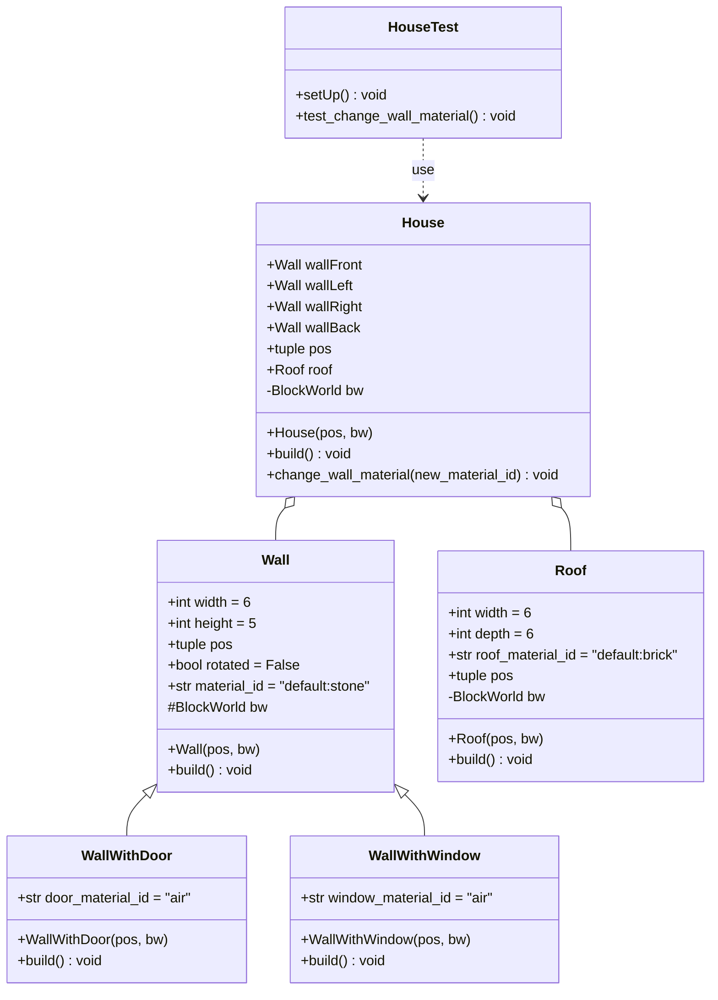
