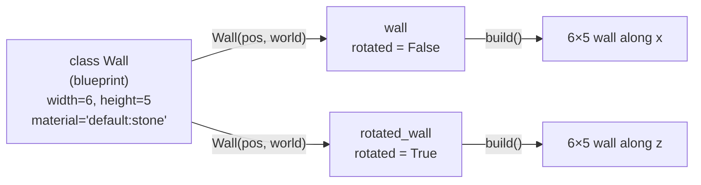
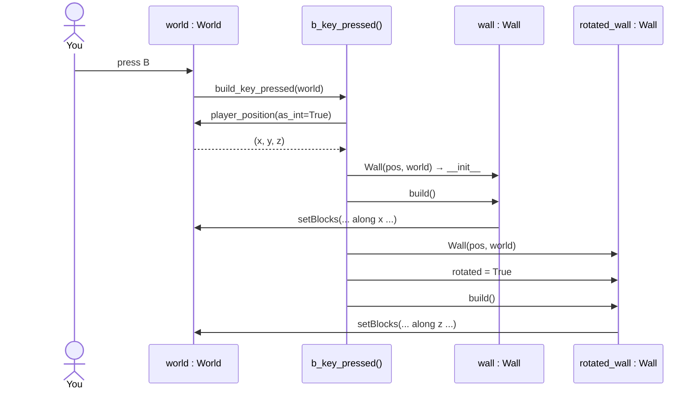
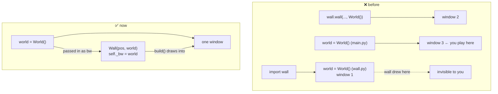
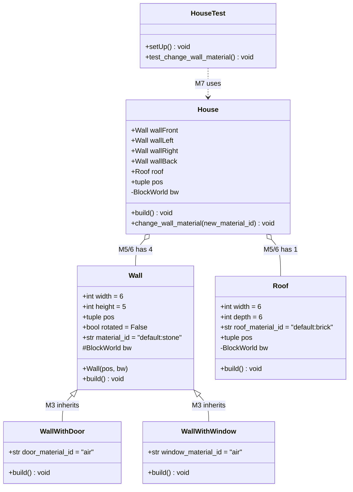

# Blockwelt-Explorer – Concepts

Visual cheat sheet for the worksheet. Milestones 1–2 are done; the roadmap at the end shows what comes next.

---

## 1. Coordinates

```
        y (up)
        │
        │
        └────── x
       ╱
      z
```

- Ground (grass) is at **y = -2**, so the first free layer is **y = -1**.
- `player_position()` returns floats; `as_int=True` gives whole block numbers.

---

## 2. `setBlocks` takes two corners, not sizes

```python
world.setBlocks(x1, y1, z1,   x2, y2, z2,   material)
#               └ corner A ┘   └ corner B ┘
```

Everything in the box between A and B is filled, **with both corners included**.

```
Want 3 blocks in x, starting at x = 12:

x:   11   12   13   14   15
          [■]  [■]  [■]
           A         B          A = 12,  B = 12 + 3 - 1 = 14
```

> **Rule:** `end = start + count - 1`

❌ Old code: `setBlocks(x, y, z, 3, -1, 0, …)` treated `3, -1, 0` as fixed world coordinates.
Standing at x = 40 gave a strip from 40 down to 3 (38 blocks).

✅ Milestone 1 (`nr_1.py`), seen from the side:

```
 y
 3   S
 2   S                 S = sand   (4 in y)
 1   S                 B = brick  (3 in x)
 0   S                 T = stone  (5 in z, goes "into" the screen)
-1   B  B  B
     ─────────── x
     T T T T T  → z
```

---

## 3. Class vs. object

A **class** is the blueprint, an **object** is one thing built from it.
Every object has its *own* attributes (`self.…`).



---

## 4. Reading the UML class diagram

```
┌──────────────────────────────┐
│ Wall                         │  ← class name
├──────────────────────────────┤
│ + width: int = 6             │  ← attribute : type = default
│ # bw: BlockWorld             │
├──────────────────────────────┤
│ + Wall(pos, bw)              │  ← constructor  →  __init__(self, pos, bw)
│ + build(): void              │  ← method, returns nothing
└──────────────────────────────┘
```

| UML | Meaning | Python |
|---|---|---|
| `+` | public: anyone may use it | `self.width` |
| `#` | protected: class + subclasses | `self._bw` (one `_`) |
| `-` | private: only this class | `self.__bw` (two `__`) |
| `= 6` | default value | set in `__init__`, **not** a parameter |
| `Wall(pos, bw)` | constructor | `def __init__(self, pos, bw)` |
| `: void` | returns nothing | no `return` |

> Python doesn't *enforce* `_`/`__`, it's a convention (and `__` triggers name mangling → `obj._Wall__bw`).

---

## 5. `rotated`: turning 90° around the y-axis

Top view (looking down, y points at you), wall starting at `pos = P`:

```
rotated = False             rotated = True
(runs along x)              (runs along z)

z                           z
↑                           ↑   ■
│                           │   ■
│                           │   ■
│                           │   ■
│                           │   ■
│   P ■ ■ ■ ■ ■             │   P
└──────────────→ x          └──────────────→ x
```

```python
if self.rotated:   # x stays fixed, z grows
    setBlocks(x, y, z,   x,               top, z + width - 1, …)
else:              # z stays fixed, x grows
    setBlocks(x, y, z,   x + width - 1,   top, z,             …)
```

Both walls in `main.py` start at the same `pos`, so they form an **L-corner**.

---

## 6. What happens when you press B



---

## 7. Why only ONE `World()`

Every `World()` opens its **own window**. The old code made three:



> **Pattern: dependency injection.** The wall doesn't create its world, it gets it passed in (`bw`).
> That's why the diagram has `bw` in every class.

---

## 8. Roadmap: the full worksheet diagram



| Arrow | Name | Meaning | Milestone |
|---|---|---|---|
| `──▷` hollow triangle | **Inheritance** | "is a": a `WallWithDoor` *is a* `Wall` | 3 |
| `──◇` hollow diamond | **Aggregation** | "has a": the House *has* walls/roof (parts can exist alone) | 5, 6 |
| `──◆` filled diamond | **Composition** | "has a, owns it": parts die with the whole | 5 |
| `- - ->` dashed | **Dependency / use** | the test *uses* House | 7 |
| `+ # -` | **Visibility** | see section 4 | 4 |
